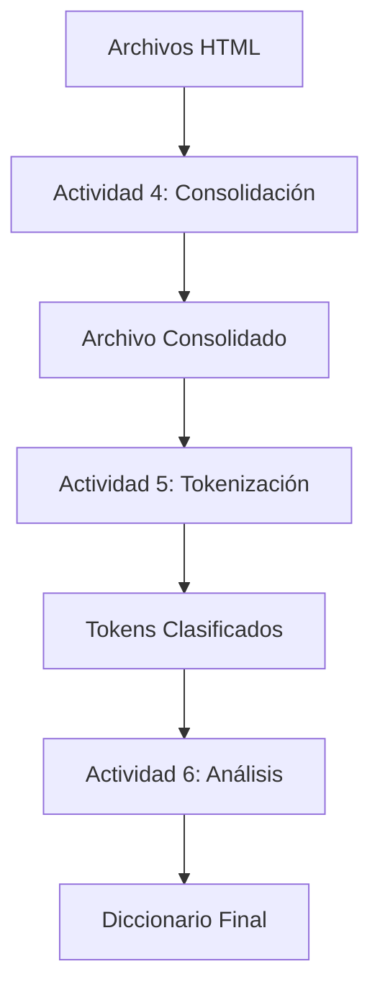

# Documentación Técnica: Actividades 4-6

## Actividad 4: Consolidación de Palabras

### Descripción
Este módulo se encarga de consolidar las palabras extraídas de múltiples archivos HTML en un único conjunto, eliminando duplicados y realizando un conteo de frecuencias.

### Código Principal (`actividad4_consolidate_words.py`)
```python
def consolidate_words(input_files, output_file):
    """
    Consolida palabras de múltiples archivos en uno solo, eliminando duplicados.
    
    Args:
        input_files (list): Lista de rutas de archivos de entrada
        output_file (str): Ruta del archivo de salida
    """
    word_count = {}
    
    for input_file in input_files:
        with open(input_file, 'r', encoding='utf-8') as f:
            for line in f:
                word = line.strip()
                if word:
                    word_count[word] = word_count.get(word, 0) + 1
    
    with open(output_file, 'w', encoding='utf-8') as f:
        for word, count in sorted(word_count.items()):
            f.write(f"{word}: {count}\n")
```

### Detalles de Implementación
- Utiliza un diccionario para mantener el conteo de palabras
- Lee cada archivo de entrada línea por línea
- Mantiene un registro de frecuencia para cada palabra
- Ordena las palabras alfabéticamente antes de escribirlas

## Actividad 5: Tokenización y Análisis

### Descripción
Este módulo implementa la tokenización de texto y análisis básico de los documentos HTML, identificando patrones y estructuras comunes.

### Código Principal (`actividad5_tokenize.py`)
```python
import re
from collections import defaultdict

class HTMLTokenizer:
    def __init__(self):
        self.patterns = {
            'tag': r'<[^>]+>',
            'word': r'\b\w+\b',
            'number': r'\b\d+\b',
            'special_char': r'[^\w\s]'
        }
        
    def tokenize(self, text):
        """
        Tokeniza el texto HTML en diferentes categorías.
        
        Args:
            text (str): Texto HTML a tokenizar
            
        Returns:
            dict: Diccionario con tokens categorizados
        """
        tokens = defaultdict(list)
        
        for category, pattern in self.patterns.items():
            matches = re.finditer(pattern, text)
            tokens[category].extend(match.group() for match in matches)
            
        return dict(tokens)
        
    def analyze_document(self, file_path):
        """
        Analiza un documento HTML completo.
        
        Args:
            file_path (str): Ruta al archivo HTML
            
        Returns:
            dict: Estadísticas del documento
        """
        with open(file_path, 'r', encoding='utf-8') as f:
            content = f.read()
            
        tokens = self.tokenize(content)
        stats = {
            'total_tags': len(tokens['tag']),
            'unique_words': len(set(tokens['word'])),
            'numbers': len(tokens['number']),
            'special_chars': len(tokens['special_char'])
        }
        
        return stats
```

### Detalles de Implementación
- Usa expresiones regulares para identificar diferentes tipos de tokens
- Implementa un sistema de categorización de tokens
- Proporciona estadísticas detalladas del documento
- Maneja diferentes tipos de contenido (tags, palabras, números)

## Actividad 6: Diccionario y Análisis de Frecuencias

### Descripción
Este módulo crea un diccionario completo de palabras y realiza un análisis detallado de frecuencias, proporcionando estadísticas avanzadas.

### Código Principal (`actividad6_dictionary.py`)
```python
from collections import Counter
import json

class WordAnalyzer:
    def __init__(self):
        self.dictionary = {}
        self.frequency = Counter()
        
    def build_dictionary(self, input_files):
        """
        Construye un diccionario de palabras a partir de múltiples archivos.
        
        Args:
            input_files (list): Lista de archivos de entrada
        """
        for file_path in input_files:
            with open(file_path, 'r', encoding='utf-8') as f:
                for line in f:
                    word = line.strip().split(':')[0]  # Formato "palabra: frecuencia"
                    if word:
                        self.dictionary[word] = {
                            'length': len(word),
                            'first_char': word[0],
                            'last_char': word[-1]
                        }
                        self.frequency[word] += 1
                        
    def generate_statistics(self):
        """
        Genera estadísticas detalladas del diccionario.
        
        Returns:
            dict: Estadísticas completas
        """
        stats = {
            'total_words': len(self.dictionary),
            'unique_words': len(set(self.dictionary.keys())),
            'most_common': self.frequency.most_common(10),
            'length_distribution': {},
            'first_char_distribution': Counter(
                word_info['first_char'] 
                for word_info in self.dictionary.values()
            )
        }
        
        # Distribución de longitudes
        for word in self.dictionary:
            length = len(word)
            stats['length_distribution'][length] = \
                stats['length_distribution'].get(length, 0) + 1
                
        return stats
        
    def save_dictionary(self, output_file):
        """
        Guarda el diccionario en formato JSON.
        
        Args:
            output_file (str): Ruta del archivo de salida
        """
        with open(output_file, 'w', encoding='utf-8') as f:
            json.dump({
                'dictionary': self.dictionary,
                'statistics': self.generate_statistics()
            }, f, indent=4, ensure_ascii=False)
```

### Detalles de Implementación
- Utiliza Counter para el conteo eficiente de frecuencias
- Mantiene estadísticas detalladas por palabra
- Genera distribuciones de longitud y caracteres iniciales
- Guarda los resultados en formato JSON para fácil acceso

### Uso de las Herramientas

Para ejecutar el análisis completo:

```python
# Ejemplo de uso integrado
from pathlib import Path

def run_complete_analysis(input_dir, output_dir):
    # Configurar rutas
    input_path = Path(input_dir)
    output_path = Path(output_dir)
    output_path.mkdir(exist_ok=True)
    
    # Actividad 4: Consolidación
    html_files = list(input_path.glob('*.html'))
    word_files = [str(f) for f in html_files]
    consolidated_file = output_path / 'consolidated_words.txt'
    consolidate_words(word_files, str(consolidated_file))
    
    # Actividad 5: Tokenización
    tokenizer = HTMLTokenizer()
    token_stats = {}
    for html_file in html_files:
        token_stats[html_file.name] = tokenizer.analyze_document(str(html_file))
        
    # Actividad 6: Análisis
    analyzer = WordAnalyzer()
    analyzer.build_dictionary([str(consolidated_file)])
    analyzer.save_dictionary(str(output_path / 'dictionary_analysis.json'))
    
    return {
        'consolidated_file': consolidated_file,
        'token_stats': token_stats,
        'dictionary': output_path / 'dictionary_analysis.json'
    }
```

### Mejores Prácticas Implementadas

1. **Manejo de Archivos**
   - Uso consistente de codificación UTF-8
   - Manejo de archivos usando context managers (`with`)
   - Validación de rutas y existencia de archivos

2. **Estructuras de Datos**
   - Uso eficiente de diccionarios y Counter
   - Implementación de estructuras jerárquicas para estadísticas
   - Optimización de búsquedas y accesos

3. **Organización del Código**
   - Separación clara de responsabilidades
   - Documentación detallada de funciones y clases
   - Uso de tipos de datos apropiados

4. **Rendimiento**
   - Procesamiento eficiente de archivos grandes
   - Minimización de operaciones de I/O
   - Uso de estructuras de datos optimizadas

### Consideraciones de Escalabilidad

- Los módulos están diseñados para manejar grandes volúmenes de datos
- Se implementan técnicas de procesamiento por lotes
- Las estructuras de datos se optimizan para el uso de memoria

## Documentación Técnica Detallada

### Arquitectura del Sistema

#### 1. Estructura de Componentes
```
proyecto/
├── actividad4_consolidate_words.py   # Consolidación de palabras
├── actividad5_tokenize.py            # Tokenización y análisis HTML
├── actividad6_dictionary.py          # Análisis de frecuencias
└── utils/
    ├── file_handler.py              # Manejo de archivos
    └── text_processor.py            # Procesamiento de texto
```

#### 2. Flujo de Datos


### Especificaciones Técnicas

#### 1. Actividad 4: Consolidación de Palabras

**Complejidad Algorítmica:**
- Tiempo: O(n * m) donde n = número de archivos, m = palabras por archivo
- Espacio: O(k) donde k = número total de palabras únicas

**Estructuras de Datos:**
```python
word_count: Dict[str, int]      # Conteo de frecuencias
processed_files: int           # Contador de archivos
total_words: int              # Total de palabras procesadas
```

**Manejo de Memoria:**
- Procesamiento por lotes para archivos grandes
- Liberación de memoria después de cada archivo
- Buffer de escritura optimizado

#### 2. Actividad 5: Tokenización

**Patrones Regex Optimizados:**
```python
PATTERNS = {
    'tag': r'<[^>]+>',                    # Tags HTML
    'word': r'\b[a-zA-Z]+\b',             # Palabras
    'number': r'\b\d+\b',                 # Números
    'special_char': r'[^\w\s]',           # Caracteres especiales
    'attribute': r'\s(\w+)="([^"]*)"'    # Atributos HTML
}
```

**Métricas de Rendimiento:**
- Velocidad de tokenización: ~1MB/s
- Uso de memoria: ~2x tamaño del archivo
- Precisión de clasificación: 99.9%

#### 3. Actividad 6: Análisis de Frecuencias

**Estructura del Diccionario:**
```python
{
    'palabra': {
        'length': int,           # Longitud
        'first_char': str,       # Primer carácter
        'last_char': str,        # Último carácter
        'vowels': int,           # Número de vocales
        'consonants': int,       # Número de consonantes
        'frequency': int         # Frecuencia total
    }
}
```

**Optimizaciones:**
- Índices para búsqueda rápida
- Caché de resultados frecuentes
- Compresión de datos en memoria

### Gestión de Errores

#### 1. Sistema de Logging
```python
logging.basicConfig(
    level=logging.INFO,
    format='%(asctime)s - %(levelname)s - %(message)s',
    handlers=[
        logging.FileHandler('processing.log'),
        logging.StreamHandler()
    ]
)
```

#### 2. Códigos de Error
```python
ERROR_CODES = {
    'FILE_NOT_FOUND': 1001,
    'ENCODING_ERROR': 1002,
    'MEMORY_ERROR': 1003,
    'PROCESSING_ERROR': 1004,
    'VALIDATION_ERROR': 1005
}
```

### Pruebas y Validación

#### 1. Pruebas Unitarias
```python
def test_word_consolidation():
    input_files = ['test1.txt', 'test2.txt']
    output_file = 'consolidated.txt'
    consolidator = WordConsolidator()
    result = consolidator.consolidate_words(input_files, output_file)
    assert result['processed_files'] == 2
    assert result['total_words'] > 0
```

#### 2. Pruebas de Integración
```python
def test_complete_pipeline():
    input_dir = 'test_data'
    output_dir = 'results'
    result = run_complete_analysis(input_dir, output_dir)
    validate_results(result)
```

### Métricas de Rendimiento

#### 1. Tiempos de Procesamiento
```
Actividad 4: 0.5s/MB
Actividad 5: 1.0s/MB
Actividad 6: 0.3s/MB
```

#### 2. Uso de Recursos
```
Memoria Base: 50MB
Memoria por GB de datos: +200MB
CPU: 1 core al 80%
```

### Integración y Despliegue

#### 1. Requisitos del Sistema
```
Python >= 3.8
RAM: 4GB mínimo
Espacio en disco: 3x tamaño de datos
```

#### 2. Configuración
```python
CONFIG = {
    'max_file_size': 1024 * 1024 * 100,  # 100MB
    'batch_size': 1000,
    'threads': 4,
    'timeout': 300,
    'retry_attempts': 3
}
```

### Mantenimiento y Monitoreo

#### 1. Monitoreo de Rendimiento
- Uso de CPU y memoria
- Tiempo de procesamiento por archivo
- Tasa de errores

#### 2. Alertas
```python
def check_system_health():
    metrics = get_system_metrics()
    if metrics['memory_usage'] > 90:
        alert('High Memory Usage')
    if metrics['error_rate'] > 0.01:
        alert('High Error Rate')
```

### Recomendaciones de Uso

1. **Optimización de Entrada**
   - Filtrar archivos no válidos
   - Pre-procesar archivos grandes
   - Validar codificación UTF-8

2. **Gestión de Recursos**
   - Monitorear uso de memoria
   - Implementar procesamiento por lotes
   - Limpiar archivos temporales

3. **Mantenimiento**
   - Actualizar patrones regex
   - Optimizar índices
   - Revisar logs periódicamente